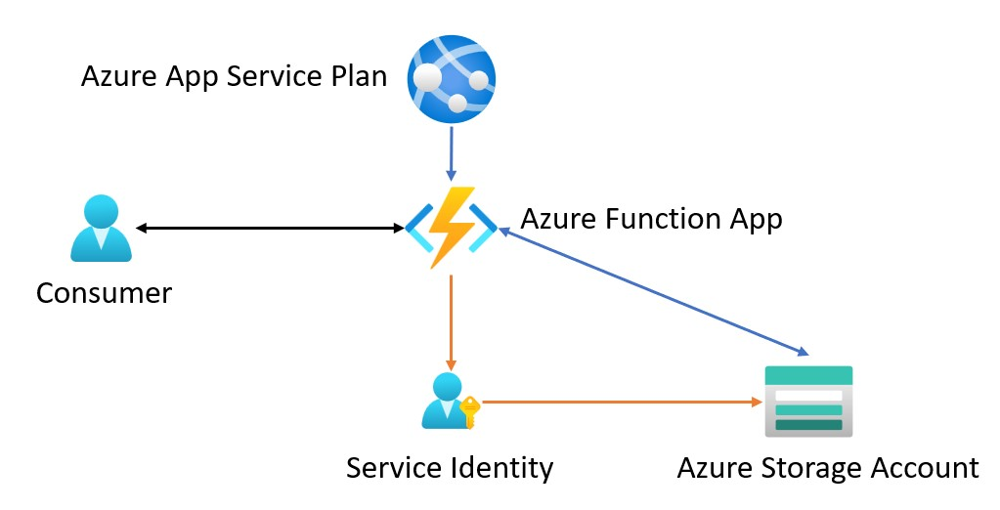
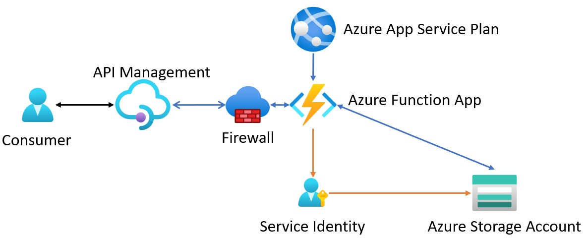

# Azure Function App

This repository holds a simple example of using an Azure Function App, written in Python. 

This simple REST API can be run using Visual Studio Code or directly in Azure. 

# Contents

- [Repository Content](#repository-content)
- [Architecture](#architecture)
- [Exposed Endpoints](#endpoints)
- [Execution Notes](#execution-notes)
- [Securing your API](#securing-your-api)
- [Extend your API](#adding-a-new-call)

## Repository Content

- Directory __functionapp__ contains the code of the Python based Function App.
- Directory __postman__ contains postman scripts to test the function app locally OR when deployed. 

 

## Architecture

This demo is made up of a small handful of services in Azure. Specifically

- An Azure Application Service Plan to host your Function App.
- An Azure Function App that hosts the actual API, with a service identity defined.
- [Optional] Application insights and storage if configured when you deploy your function app. 
- Azure Storage Account in which to host the storage table that the API will read/write to. Note that you must also include the service identity of the function app as a contributor to this resource directly. 

 

## Endpoints
Currently the exposed endpoints of the function application are as follows. 

|Endpoint|Action|Description|
|---|---|---|
|https:..../api/info|GET|Retrieve basic information about the service.|
|https:..../api/users?user_id=XXX|GET|Retrieve information about a single user.|
|https:..../api/users|GET|Retrieve basic information about all users.|
|https:..../api/users?user_id=XXX|DELETE|Delete a single user.|
|https:..../api/users|POST|Add or update a user.|

 

## Execution Notes
If running locally, ensure that ...\functionapp\utils\identity\credcollector.py:12 is using AzureCliCredential. Switch back to DefaultAzureCredential when deploying to your function app. 

Note that this simple demo does NOT use any API keys or other security on the exposed endpoints. 

Security between the app and the storage account is managed via the system identity of the function app.

## Securing your API

All of the API's are anonymous access, so how do you protect them? Using built in firewalls on the Azure Function App

Create an API Management Instance

- Import your Function App in the API's section
- In the API Management service, go to Settings/Properties and copy the IP address for the service.
- Go to the Function App Networking/Access Restrictions
    - Add an IP rule with allow and put in the APIM IP address
- Done!

If you try this, you'll find that your postman script cannot reach out to the endpoints again, but if you call the APIM endpoint, it will succeed. 

You have locked down your API from direct access!

## Adding a new call

So, I added a new call but APIM was having trouble importing the Function App again...I'm not sure how I thought that would work....but that wasn't it. 

I then created a new call in the API...which also was giving me 500 errors every time I called it, which I thought was odd but....still not there. 

The solution was to clone an existing call then edit the endpoint/name and I was finally able to add the call AND sucessfully test it. 